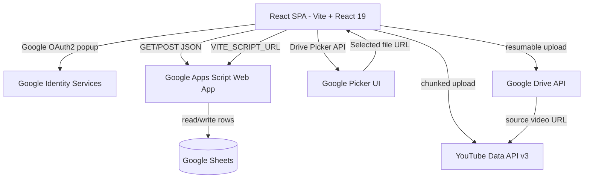

# 🏗️ Architecture — MG-YT-Dashboard

## Overview

A fully serverless React SPA. No Node.js backend, no database. All persistence is through Google Sheets via a Google Apps Script Web App that acts as a REST-like API.

---

## Layer Diagram

---

## Data Flow

### Story Lifecycle

1. **Sheets → React**: `fetchStories()` calls GAS `?action=getAllStories` → returns JSON array
2. **React → Sheets**: `updateStory(rowId, updates)` calls GAS `?action=updateStory&rowId=...&updates=...`
3. **React local state**: Optimistically updated after each successful Sheet write

### Asset Attachment (Storyboard)

Three methods supported:
1. **Paste URL** — User copies Drive share link and pastes it
2. **Drive Picker** — `gapi.load('picker', ...)` opens native Drive browser; returns file ID → constructs share URL
3. **Local Upload** — `XMLHttpRequest` resumable upload to Drive API → returns `fileId` → sets public permission → constructs share URL

### Publishing (Drive → YouTube)

1. Get video file ID from Drive share URL
2. Fetch video as `ArrayBuffer` from Drive
3. POST to YouTube `/upload/youtube/v3/videos?uploadType=resumable` with metadata
4. Stream video in chunks (default 5MB each)
5. On 200/201, update story `dashStatus = published` in Sheets

---

## Key Files

| File | Purpose |
|---|---|
| `src/lib/config/env.js` | Central config — localStorage first, then `.env` fallback |
| `src/lib/api.js` | `fetchStories`, `updateStory`, Drive URL helpers |
| `src/lib/api/client.js` | Retry-able fetch with GAS HTML redirect handling |
| `src/hooks/useStories.js` | All story state + pipeline status mutations |
| `src/context/AuthContext.jsx` | Google OAuth2 sign-in, access token management |
| `src/services/publishService.js` | Drive → YouTube upload engine (7-stage) |
| `src/services/upload/driveUpload.js` | Drive resumable upload + permission setter |
| `src/components/Storyboard/Storyboard.jsx` | Drive Picker + local upload + URL paste |
| `src/components/Review/ReviewCard.jsx` | iframe video preview + image thumbnail |

---

## Environment Variables

All `VITE_` prefixed — bundled at build time. Can be overridden at runtime via Settings Drawer (localStorage).

| Variable | Used By |
|---|---|
| `VITE_GOOGLE_CLIENT_ID` | AuthContext — OAuth2 login |
| `VITE_GOOGLE_API_KEY` | Drive Picker (gapi developer key) |
| `VITE_SCRIPT_URL` | api.js — GAS backend calls |
| `VITE_YOUTUBE_CHANNEL_ID` | publishService — channel targeting |
| `VITE_DRIVE_FOLDER_ID` | driveUpload — upload destination |
| `VITE_YOUTUBE_PLAYLIST_ID` | publishService — optional playlist add |
