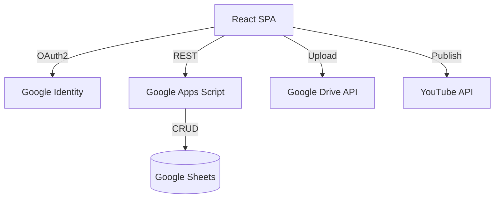

# Architecture Documentation

## Core Architecture

This project is a React Single Page Application (SPA) with a serverless architecture.

## Technologies

- **Frontend:** React 19, Vite 8, Chart.js.
- **Backend:** Google Apps Script (`Code.gs`) acting as a REST API.
- **Database:** Google Sheets.
- **Auth:** Browser-side Google Identity Services.
- **Deployment:** Vercel.

---

## 👨‍💻 Credits

**By OutLawZ™** | https://www.brandex.pk | net2tara@gmail.com
