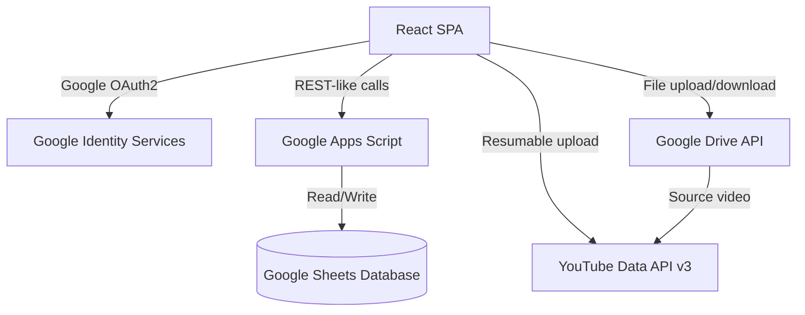

# 🎬 Bright Little Stories — Production Dashboard

---

# Description

**MG-YT-Dashboard** is a full-stack YouTube content pipeline manager built as a React SPA with no traditional backend or database. Google Sheets (via Apps Script) serves as the API and database, Google Drive as the file store, and YouTube Data API v3 handles publishing. It features a NeoBrutalism-inspired UI with multiple themes, KPI dashboards, Drive-to-YouTube publishing, and a story workflow system from raw script to live upload.

---

# 🚀 Features

- **End-to-End Pipeline UI:** Story → Storyboard → Review/Approve → Publish to YouTube.
- **Google OAuth2 Auth:** Browser-side authentication using Google Identity Services.
- **Drive → YouTube Engine:** 7-stage chunked resumable upload from Drive to YouTube with progress bar.
- **Google Apps Script Backend:** `Code.gs` deployed as Web App replaces a traditional REST API.
- **Multi-Theme Support:** Dark, Light, Glass, Midnight, Neon themes with theme context.
- **KPI Dashboard:** Pipeline status counts, bar charts, and donut chart via Chart.js.
- **Vercel Deployment:** SPA routing and asset caching via `vercel.json`.
- **Runtime Configuration:** All credentials configurable via Settings Drawer — no redeploy required.

---

# 🛠️ Tech Stack

| Layer | Technology |
| --- | --- |
| **Frontend** | React 19, Vite 8 |
| **Charts** | Chart.js, react-chartjs-2 |
| **Icons** | lucide-react |
| **Notifications** | sonner |
| **Sheets Backend** | Google Apps Script (Code.gs) |
| **Auth** | Google OAuth2 Identity Services |
| **Storage** | Google Drive API, Google Sheets API |
| **Publishing** | YouTube Data API v3 |
| **Deployment** | Vercel |

---

# 📂 Project Structure

```text
MG-YT-Dashboard/
├── src/
│   ├── components/          # Dashboard, Stories, Storyboard, Review, Publish, Analytics
│   ├── context/             # AuthContext, ThemeContext
│   ├── hooks/               # useAuth, useStories
│   ├── lib/                 # api.js, api/client.js, config/env.js
│   ├── services/            # publishService.js, upload/driveUpload.js
│   └── styles/              # globals.css, theme files
├── Code.gs                  # Google Apps Script backend
├── vercel.json              # SPA routing + cache headers
├── .env.example             # Environment template
└── README.md                # Documentation
```

---

# 🏗️ Architecture Diagram



---

# 🔄 Story Status Flow

```
pending → storyboard → review → approved → publishing → published
                                                        ↘ scheduled
                                              publish_failed (retryable)
```

---

# 🏎️ Quick Start

```bash
npm install
cp .env.example .env.local  # Add VITE_GOOGLE_CLIENT_ID
npm run dev
```

Paste `Code.gs` into Google Sheets → Apps Script → Deploy as Web App. Set the deployment URL in the app's Settings Drawer.

---

# 🚢 Deployment (Vercel)

```bash
npm i -g vercel
vercel --prod
```

Set `VITE_GOOGLE_CLIENT_ID` in Vercel Environment Variables. `vercel.json` handles SPA routing automatically.

---

# 🔒 Security Notes

- Only `VITE_GOOGLE_CLIENT_ID` is needed in production — no service account keys required.
- Apps Script executes server-side as the owner, keeping Sheets credentials off the client.

---

# 📝 License

Private project — Bright Little Stories channel.

---

## 👨‍💻 Credits

**By OutLawZ™**

Website: https://www.brandex.pk | net2tara@gmail.com
