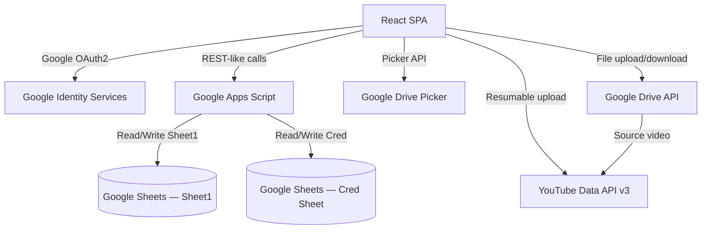

# 🎬 Bright Little Stories — Production Dashboard

> **MG-YT-Dashboard** — A full-stack YouTube content pipeline manager built as a React SPA. No traditional backend or database. Google Sheets (via Apps Script) serves as the API and database, Google Drive as the file store, and YouTube Data API v3 handles publishing.

---

## 🚀 Features

| Feature | Description |
|---|---|
| **End-to-End Pipeline** | Story → Storyboard → Review/Approve → Publish to YouTube |
| **Google OAuth2 Auth** | Browser-side authentication using Google Identity Services |
| **Drive Picker** | Pick video/thumbnail directly from Google Drive via native Picker API |
| **Drive → YouTube Engine** | 7-stage chunked resumable upload from Drive to YouTube with progress bar |
| **Google Apps Script Backend** | `Code.gs` deployed as Web App — replaces a traditional REST API |
| **Multi-Theme Support** | Dark, Light, Glass, Midnight, Neon themes with theme context |
| **KPI Dashboard** | 8-metric KPI cards, pipeline bar chart, category donut chart via Chart.js |
| **Analytics Page** | Pipeline status, category breakdown, asset coverage %, activity timeline |
| **Review Tab Previews** | Embedded Drive video (iframe) + thumbnail preview with fallback |
| **Settings Drawer** | All credentials configurable at runtime — no redeploy required |
| **Accounts / CredVault** | View credentials from "Cred" sheet — one-click copy for email & password, inline edit for Credit & Tag |
| **Vercel Deployment** | SPA routing and asset caching via `vercel.json` |

---

## 🛠️ Tech Stack

| Layer | Technology |
|---|---|
| **Frontend** | React 19, Vite 8 |
| **Charts** | Chart.js 4, react-chartjs-2 |
| **Icons** | lucide-react |
| **Notifications** | sonner |
| **Sheets Backend** | Google Apps Script (Code.gs) |
| **Auth** | Google OAuth2 Identity Services |
| **Drive Picker** | Google Picker API (gapi) |
| **Storage** | Google Drive API, Google Sheets API |
| **Publishing** | YouTube Data API v3 |
| **Deployment** | Vercel |

---

## 📂 Project Structure

```text
MG-YT-Dashboard/
├── src/
│   ├── components/
│   │   ├── Accounts/       # CredVault — view/edit credentials from "Cred" sheet
│   │   ├── Analytics/      # Analytics.jsx — 8 KPIs, charts, timeline, asset coverage
│   │   ├── Dashboard/      # KPI cards, bar chart, donut chart, pipeline view
│   │   ├── Review/         # ReviewCard.jsx — Drive iframe preview for video & thumbnail
│   │   ├── Publish/        # PublishForm.jsx — Drive→YouTube upload engine
│   │   ├── Stories/        # StoryTable.jsx — searchable/filterable story table
│   │   ├── Storyboard/     # Storyboard.jsx — Drive Picker + local upload + URL paste
│   │   ├── Header.jsx
│   │   ├── Tabs.jsx
│   │   └── SettingsDrawer.jsx
│   ├── context/            # AuthContext.jsx, ThemeContext.jsx
│   ├── hooks/              # useAuth.js, useStories.js, useAccounts.js
│   ├── lib/
│   │   ├── api.js          # fetchStories, fetchAccounts, updateStory, updateAccount
│   │   ├── api/client.js   # Retry-able fetch with GAS redirect handling
│   │   └── config/env.js   # All ENV vars — localStorage first, then .env
│   ├── services/
│   │   ├── publishService.js   # YouTube upload engine
│   │   └── upload/driveUpload.js # Drive resumable upload
│   └── styles/             # globals.css, theme CSS files
├── .env.example            # Full environment template (all 6 variables)
├── vercel.json             # SPA routing + cache headers
├── package.json            # v1.2.0 — includes deploy script
└── index.html              # Loads Google GSI + GAPI scripts
```

---

## 🏗️ Architecture Diagram



---

## 🔄 Story Status Flow

```
pending → storyboard → review → approved → publishing → published
                                                        ↘ scheduled
                                              publish_failed (retryable)
```

---

## 🗄️ Accounts / CredVault Tab

The **Accounts** tab reads from the `Cred` sheet in your Google Spreadsheet. It requires these columns in order:

| Column | Key | Description |
|---|---|---|
| A | `username` | Email / Account ID |
| B | `password` | Password (masked by default) |
| C | `tags` | Status tag: `new`, `verified`, `v-pending`, `used` |
| D | `Credit` | Credit score / balance (number) |

**Features:**
- One-click copy for email and password
- Toggle password visibility per card
- Inline edit for **Credit** and **Tag** — click the ✏️ pencil icon on any card
- Filter bar: ALL / NEW / VPENDING / USED

**Apps Script action required:** Add `getAccounts` and `updateAccount` handlers to your `Code.gs`. See [GUIDE.md](./GUIDE.md) for the full snippet.

---

## 🏎️ Quick Start

```bash
git clone https://github.com/0utLawzz/MG-YT-Dashboard.git
cd MG-YT-Dashboard
npm install
cp .env.example .env
# Edit .env — fill in VITE_GOOGLE_CLIENT_ID and other values
npm run dev
```

Paste `Code.gs` into Google Sheets → Apps Script → Deploy as Web App. Set the deployment URL in the app's Settings Drawer or in `.env` as `VITE_SCRIPT_URL`.

---

## 🚢 Deployment (Vercel)

See [PRODUCTION.md](./PRODUCTION.md) for the full step-by-step production deployment guide.

### Option 1 — CLI (one command)
```bash
npm run deploy
# This runs: npm run build && vercel --prod
```

### Option 2 — Manual steps
```bash
npm run build
vercel --prod
```

### Required Vercel Environment Variables

Go to **Vercel Dashboard → Project → Settings → Environment Variables** and add:

| Variable | Required | Description |
|---|---|---|
| `VITE_GOOGLE_CLIENT_ID` | ✅ Yes | Google OAuth2 Client ID |
| `VITE_GOOGLE_API_KEY` | ✅ Yes | Google API Key (Drive Picker + YouTube) |
| `VITE_SCRIPT_URL` | ✅ Yes | Apps Script Web App deployment URL |
| `VITE_YOUTUBE_CHANNEL_ID` | ✅ Yes | YouTube channel ID (starts with UC) |
| `VITE_DRIVE_FOLDER_ID` | Optional | Drive folder ID for uploads |
| `VITE_YOUTUBE_PLAYLIST_ID` | Optional | Playlist to auto-add published videos |

> **Note:** `VITE_GOOGLE_CLIENT_ID` and `VITE_SCRIPT_URL` are the minimum required for the app to work. Others can be configured at runtime via the **Settings Drawer**.

---

## 🔒 Security Notes

- Only `VITE_GOOGLE_CLIENT_ID` and `VITE_GOOGLE_API_KEY` are truly required in production.
- Apps Script executes server-side as the sheet owner — keeping Sheets credentials off the client.
- The API key should be restricted in Google Cloud Console to only the required APIs and your domain.
- Never commit your real `.env` file — it's in `.gitignore`.
- The `Cred` sheet contains sensitive credentials — ensure your Google Sheet sharing settings are set to **Restricted** (not public).

---

## 📝 NPM Scripts

| Script | Command | Description |
|---|---|---|
| `npm run dev` | `vite` | Start local development server |
| `npm run build` | `vite build` | Build production bundle |
| `npm run preview` | `vite preview` | Preview production build locally |
| `npm run lint` | `eslint .` | Run ESLint |
| `npm run test` | `vitest run` | Run test suite |
| `npm run deploy` | `npm run build && vercel --prod` | Build + deploy to Vercel production |

---

## 📝 License

Private project — Bright Little Stories channel.

---

## 👨‍💻 Credits

**By OutLawZ™**

Website: https://www.brandex.pk | net2tara@gmail.com
